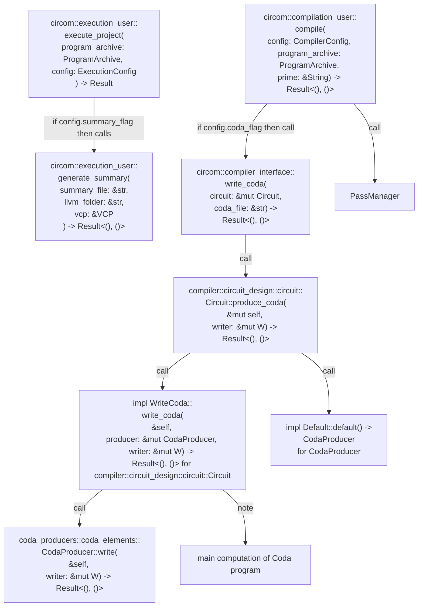

# Compilation Flow

```mermaid
flowchart TD
    execute_project["circom::execution_user::\nexecute_project(\nprogram_archive: ProgramArchive, \nconfig: ExecutionConfig\n) -> Result<VCP, ()>"]
    generate_summary["circom::execution_user::\ngenerate_summary(\nsummary_file: &str, \nllvm_folder: &str, \nvcp: &VCP\n) -> Result<(), ()>"]

    execute_project -- "if config.summary_flag then calls" --> generate_summary

    compile["circom::compilation_user::\ncompile(\nconfig: CompilerConfig, \nprogram_archive: ProgramArchive, \nprime: &String) -> \nResult<(), ()>"]

    write_coda["circom::compiler_interface::\nwrite_coda(\ncircuit: &mut Circuit, \ncoda_file: &str) -> \nResult<(), ()>"]

    produce_coda["compiler::circuit_design::circuit::\nCircuit::produce_coda<W: Write>(\n&mut self, \nwriter: &mut W) -> \nResult<(), ()>"]

    Circuit_write_coda["impl WriteCoda::\nwrite_coda<W: Write>(\n&self, \nproducer: &mut CodaProducer, \nwriter: &mut W) -> \nResult<(), ()> for compiler::circuit_design::circuit::Circuit"]

    producer_write["coda_producers::coda_elements::\nCodaProducer::write<W: Write>(\n&self, \nwriter: &mut W) -> \nResult<(), ()>"]

    CodaProducer_default["impl Default::default() -> \nCodaProducer \nfor CodaProducer"]

    compile -- "call" --> PassManager

    compile -- "if config.coda_flag then call" --> write_coda
    
    write_coda -- "call" --> produce_coda

    produce_coda -- "call" --> CodaProducer_default

    produce_coda -- "call" --> Circuit_write_coda

    Circuit_write_coda -- "call" --> producer_write

    Circuit_write_coda -- "note" --> Circuit_write_coda_note["main computation of Coda program"]
```