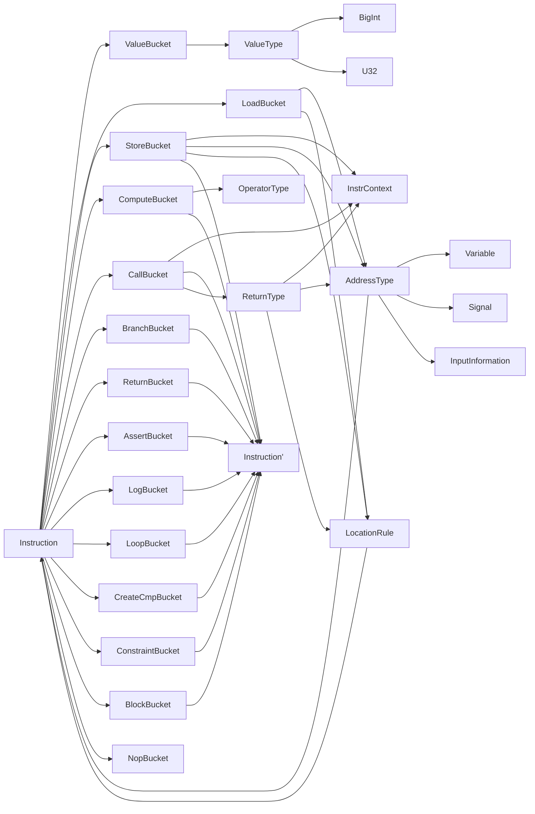

# Intermediate Representation

```mermaid
graph LR
Instruction
Instruction --> ValueBucket
Instruction --> LoadBucket
Instruction --> StoreBucket
Instruction --> ComputeBucket
Instruction --> CallBucket
Instruction --> BranchBucket
Instruction --> ReturnBucket
Instruction --> AssertBucket
Instruction --> LogBucket
Instruction --> LoopBucket
Instruction --> CreateCmpBucket
Instruction --> ConstraintBucket
Instruction --> BlockBucket
Instruction --> NopBucket

ValueBucket
ValueBucket --> ValueType

ValueType
ValueType --> BigInt
ValueType --> U32

LoadBucket --> AddressType
LoadBucket --> LocationRule

StoreBucket
StoreBucket --> InstrContext
StoreBucket --> AddressType
StoreBucket --> LocationRule
StoreBucket --> Instruction'

AddressType
AddressType --> Variable
AddressType --> Signal
AddressType --> Instruction
AddressType --> InputInformation

LocationRule
LocationRule --> Instruction

ComputeBucket
ComputeBucket --> OperatorType
ComputeBucket --> Instruction'

CallBucket
CallBucket --> InstrContext
CallBucket --> Instruction'
CallBucket --> ReturnType

ReturnType
ReturnType --> InstrContext
ReturnType --> AddressType
ReturnType --> LocationRule

BranchBucket
BranchBucket --> Instruction'

ReturnBucket
ReturnBucket --> Instruction'

AssertBucket
AssertBucket --> Instruction'

LogBucket
LogBucket --> Instruction'

LoopBucket
LoopBucket --> Instruction'

CreateCmpBucket
CreateCmpBucket --> Instruction'

ConstraintBucket
ConstraintBucket --> Instruction'

BlockBucket
BlockBucket --> Instruction'

NopBucket
```
